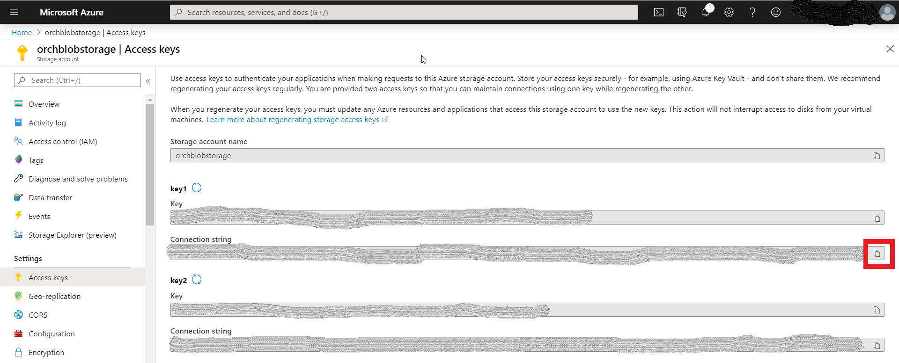
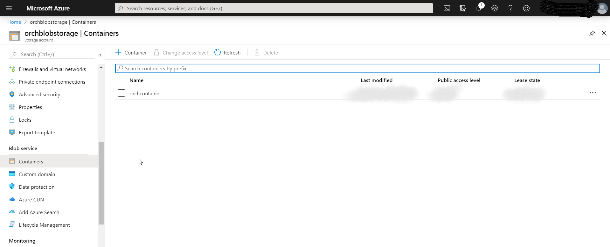

# Spring Boot App for operation on Azure Blob Storage
Azure blob storage code sample
## Key concepts
This project is an example for communicating with the Azure Blob storage using the Spring Boot.

### Prerequisites

* An Azure subscription
* A [Java Development Kit (JDK)](http://www.oracle.com/technetwork/java/javase/downloads/), version >= 1.8.
* Gradle

## Getting started

## Configuration

The access of the Azure Blob Storage is based on the connection string of the storage account. We can access 
the connection string details under the Access Keys section. Refer the screenshot below.



Next thing to grab is container name. Under the storage account there is a tab sections which lists all the containers for
 the storage account. Refer the image to know it.



Now we can set this as part of the application.yml. Go to src/main/resources for the file.
```yaml
azure:
  storage:
    connection-string: ${AZURE_STORAGE_CONNECTION_STRING}
    container-name: ${AZURE_STORAGE_CONTAINER_NAME}
```

Or we pass it as spring boot env arguments.

## Build with Gradle
``
gradlew clean build
``
## Run with Gradle

If AZURE_STORAGE_CONTAINER_NAME and AZURE_STORAGE_CONNECTION_STRING updated on the application.yml 
then we can start the server by 

``
gradlew bootRun
``

OR this way if we want to pass it as env config. 

``
set AZURE_STORAGE_CONTAINER_NAME=<container name> & set AZURE_STORAGE_CONNECTION_STRING=<connection_string>  &  gradlew bootRun
``

## Operations

* Call this endpoint URL to know the list of files under storage.

    ``
    curl -X "GET" http://localhost:8080/storage/files
    ``
* Call this endpoint to upload a file

    ``
    curl -X "POST" -F 'file=@/home/petehouston/hello.txt' http://localhost:8080/storage/upload
    ``
* Call this endpoint to delete a file

    ``
    curl -X "DELETE" http://localhost:8080/storage/delete/<filename>
    ``
* Call this endpoint to download a file

    ``
    curl -X "GET" http://localhost:8080/storage/download/<filename>
    ``

## References

[Blob Reference](https://docs.microsoft.com/en-in/azure/storage/blobs/storage-quickstart-blobs-java)
